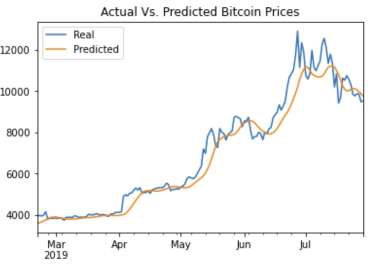
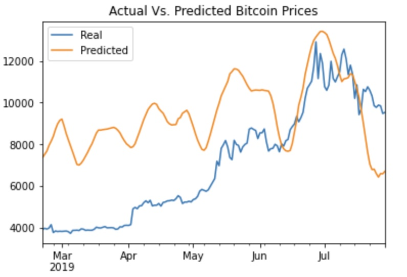

# Unit-14 LSTM Stock Predictor (Deep Learning Unit)

This unit evaluates [Long Short-Term Memory (LSTM)](https://towardsdatascience.com/illustrated-guide-to-lstms-and-gru-s-a-step-by-step-explanation-44e9eb85bf21) deep learning models to predict the Bitcoin closing prices by using two main approaches:

- Usage of previous closing prices in the model
- Usage of [Crypto Fear and Greed Index (FNG)](https://alternative.me/crypto/fear-and-greed-index/) index in the model

## Using Closing Prices in the LTSM Model

The analysis is covered in this [notebook](Notebooks/lstm_stock_predictor_closing.ipynb).  Essentially the following analysis and approach is followed:

- Reads the historic closing prices of Bitcoin
- Uses a 10-day window to predict price on 11th day using the historical price of previous 10 days.
- Splits the historical data with 70:30 split of training v/s testing data
- Build and train LSTM model using 100 `epochs` and `batch_sizes` of 50. 
- Evaluate and make predictions on the model.

The following shows the plot of actual v/s predicted price of Bitcoin using closing prices in the LTSM model.

## Using FNG Index in the LTSM Model

The analysis is covered in this [notebook](Notebooks/lstm_stock_predictor_fng.ipynb).  Essentially the following analysis and approach is followed:

- Reads the historic closing prices of Bitcoin
- Uses a 10-day window to predict price on 11th day using the FNG Index value of previous 10 days.
- Splits the historical data with 70:30 split of training v/s testing data
- Build and train LSTM model using 100 `epochs` and `batch_sizes` of 50. 

- Evaluate and make predictions on the model.

The following shows the plot of actual v/s predicted price of Bitcoin using FNG Index in the LTSM model.

## Conclusions

- The LTSM model which uses the closing prices made better predictions than using of FNG index as can be seen by the plots of price predictions.
- The loss at the end of 100 `epochs` was about 0.0066 in closing prices model compared to 0.0458 in FNG Index model which indicates the model which used closing prices was a better fit and better model than the one that uses the FNG Index.
